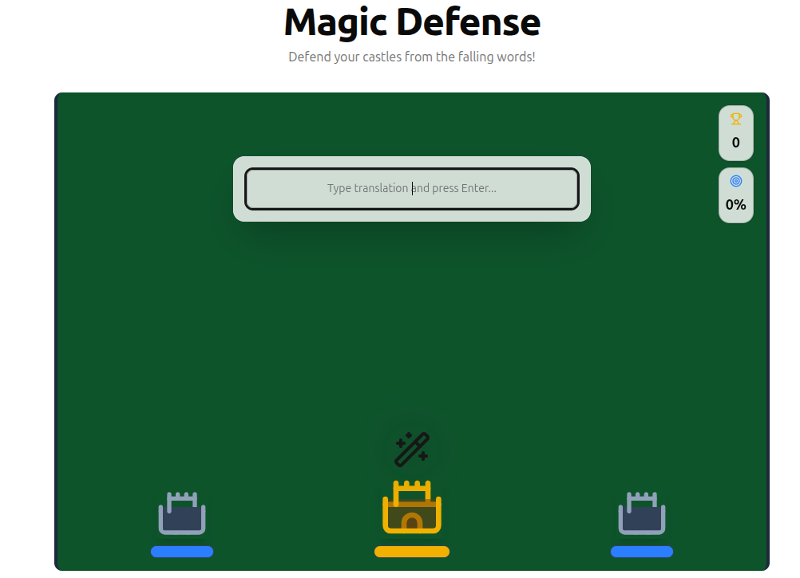

# Advantage Games

A collection of vocabulary learning games built with Next.js, designed to help users practice language terms through engaging gameplay.

## 🎮 Games

### Magic Defense
Defend your castles from falling words by typing their correct translations!



## 🛠️ Developer Guide

### Game Interface Standard

All games in this repository adhere to a strict interface for data input and progression output. This ensures seamless integration with the main platform.

#### 1. Input: Vocabulary Data
All games must accept a vocabulary list in the following JSON format:

```typescript
type VocabularyItem = {
  term: string;       // The word/phrase to learn (e.g., "สวัสดี")
  translation: string; // The answer/meaning (e.g., "Hello")
}

// Example Input
const vocabulary: VocabularyItem[] = [
  { term: 'สวัสดี', translation: 'Hello' },
  { term: 'แมว', translation: 'Cat' },
  // ...
];
```

#### 2. Output: XP & Progression
All games must calculate and expose a final **XP (Experience Points)** value upon game completion. This value is used to track user progress in the main database.

**XP Calculation Formula:**
The standard formula for XP calculation is:
```typescript
XP = Math.floor(correctAnswers * accuracy)
```
*Where `accuracy` is `correctAnswers / totalAttempts`.*

**Implementation Requirement:**
Games should expose this final XP value (e.g., via a callback prop like `onComplete(xp)` or by updating a shared store) so it can be persisted.

## 🚀 Getting Started

First, install dependencies:

```bash
npm install
# or
yarn
```

Run the development server:

```bash
npm run dev
```

Open [http://localhost:3000](http://localhost:3000) with your browser to see the result.

## 📁 Project Structure

- `src/app/games/`: Contains the individual game pages.
- `src/components/game/`: Shared game components and game-specific logic.
- `src/lib/xp.ts`: Standardized XP calculation logic.
- `public/`: Static assets (images, videos).